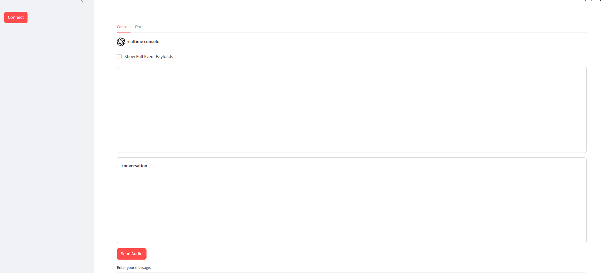

# openAi Realtime API Integration in Streamlit

Change folder directory to the one where the actual file is
Store in env variables $env:OPENAI_API_KEY = "...." 

And then run the app.py, connect to API, input the info in Json format or speak in realtime with the api

